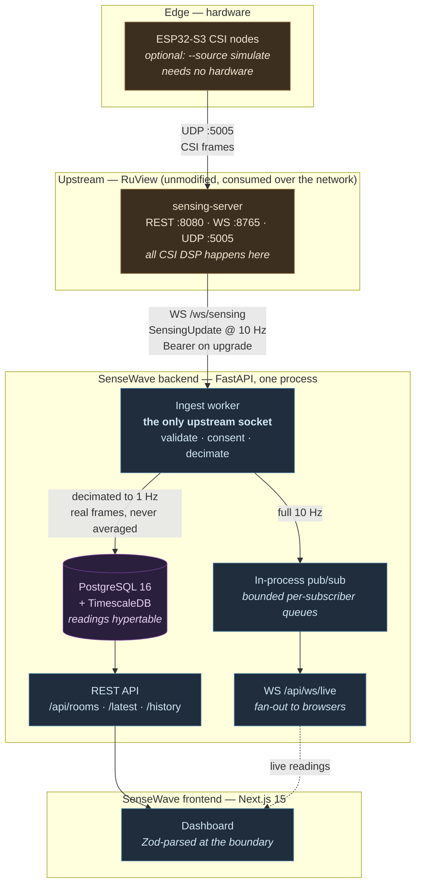

# SenseWave AI — architecture

SenseWave is the product layer over [RuView](https://github.com/ruvnet/RuView). It
does no signal processing. RuView's `sensing-server` runs as an upstream
dependency, unmodified and consumed over the network; SenseWave persists what it
emits, reasons over it, and presents it.



Browser clients never hold a socket to RuView. The dashed arrow is SenseWave's
own WebSocket; the only connection to the upstream is the single one held by the
ingest worker.


## One socket, one place to reason about it

Exactly one process holds the upstream WebSocket: `IngestWorker`, started by the
app's lifespan in `sensewave/main.py`. Browser clients never connect to RuView —
they connect to SenseWave's own `/api/ws/live`, which fans out from an
in-process pub/sub.

That single choke point is what makes the rest tractable: auth, buffering,
downsampling and reconnect policy each exist in one place rather than in every
client. It also means a slow browser cannot apply backpressure to ingest — each
subscriber gets a bounded queue and drops its own oldest frames.

Consequence worth stating plainly: the ingest worker is a single point of
failure and does not currently scale horizontally. Running two backend replicas
would open two upstream sockets and double-write `readings`. Phase 4 should
either elect a leader or split ingest into its own deployment.

## Data flow through the worker

1. **Validate.** Every frame is checked against a strict Pydantic model of
   `SensingUpdate`. Failures are counted and logged with the offending field,
   then dropped. Nothing is coerced.
2. **Enforce consent.** A room with `monitoring_enabled = false` persists
   nothing. A room with `privacy_mode = true` keeps presence and motion and
   drops vitals *before the database*, recording `vitals_suppressed = true` so
   the UI can distinguish "suppressed by consent" from "not detected".
3. **Fan out** at the full upstream rate (10 Hz) — the dashboard wants liveness.
4. **Persist by decimation** at `SENSEWAVE_INGEST_HZ` (default 1 Hz). We keep
   the most recent real frame in each interval. We never average, interpolate,
   or carry a value forward, so a gap upstream is a gap in `readings`.

## Storage: TimescaleDB with a plain-Postgres fallback

`docker-compose` runs `timescale/timescaledb-ha:pg16`. The initial migration
detects the extension: with it, `readings` becomes a hypertable partitioned on
`time` at one-day chunks; without it, `readings` stays a plain table with a BRIN
index on `time`. The backend logs which path it took at startup
(`db.storage_mode`) and `/api/health` reports it, so the deployment is never
ambiguous.

The test suite runs against the plain-Postgres path, because it uses the
`pgserver` wheel (vanilla PostgreSQL 16) so the suite needs neither Docker nor a
system Postgres.

## How the product rules are enforced in code

These are structural, not conventions — the point is that skipping them requires
deleting code rather than forgetting to add it.

| Rule | Where it lives |
|---|---|
| 1. Never render an estimate without its confidence | `VitalsOut` pairs every rate with its confidence *and* a server-computed `*_is_low_confidence` verdict. There is no field a client can bind a bare number to. |
| 2. Never fabricate data | Decimation keeps real frames; `/history` returns stored rows verbatim with nulls intact. No gap-filling anywhere. The only data generator in the repo is `tests/fake_upstream.py`. |
| 3. Stale means stale | `nodes.last_seen` + upstream's own `stale` flag. Either one marks a node stale; a room with no fresh node reports `stale: true` with a reason. |
| 4. Pose is not available | `pose_keypoints` is deliberately not modelled on `SensingUpdate`. It survives on the raw object via `extra="allow"` and nothing reads it. No skeleton view exists. |
| 5. No person identity | No person table, no identity column. `Person.id` is a within-frame track handle and is never persisted. Occupancy is an anonymous count. |
| 6. Not a medical device | The disclaimer is in the root layout, so no page can ship without it, and in the OpenAPI description. |
| 7. Consent is first-class | `rooms.monitoring_enabled` and `rooms.privacy_mode`, enforced in the ingest path (`_persist_and_publish`), not in the UI. |

## Upstream contract discrepancies

Read from the build brief's appendix (RuView commit `a3b6e1d`) and checked
against the published `ruview` client. **Not yet reconciled against a running
`sensing-server`** — Docker was unavailable on the build machine, so the server
could not be started. When it is, the server wins over everything below.

### 1. `pip install "ruview[client]"` fails as written

The only published version is `2.0.0a1`, a pre-release, which pip skips by
default. `ruview` is a meta-package that installs `wifi-densepose` and re-exports
it; `wifi-densepose`'s own latest non-prerelease is `1.99.0`, a tombstone
pointing at 2.x. The install must be pinned:

```
pip install --pre "ruview[client]==2.0.0a1"
```

### 2. `SensingClient` cannot authenticate

Its constructor is `(url, *, ping_interval, ping_timeout, max_size)` — there is
no token or header parameter, so a stock instance cannot send the Bearer header
that `/ws/sensing` expects on the upgrade. The appendix's instruction to send
the header from a native client is correct but not reachable through this class.

`sensewave/ingest/client.py` subclasses `SensingClient` and overrides only the
connect step to attach the header, inheriting the rest. It also handles the
`extra_headers` → `additional_headers` rename in websockets v14.

### 3. The client does not model `SensingUpdate`

`SensingClient._decode` handles exactly three types — `connection_established`,
`edge_vitals`, `pose_data` — and returns an untyped passthrough for anything
else, including `SensingUpdate`. We therefore consume raw dicts and validate
against our own model rather than using `SensingClient.stream()`.

The client also does not auto-reconnect, by design; the retry policy is ours
(capped exponential backoff with full jitter, in `IngestWorker.run`).

### 4. `position` and `grid_size` are JSON arrays, not tuples

Modelling them as `tuple[float, float, float]` under `strict=True` rejects every
real frame, because Pydantic will not convert a JSON array into a tuple in
strict mode. They are `Annotated[list[float], min_length=3, max_length=3]`.
Caught by the test suite, not by review.

### Still to verify against a live server

- Whether `/ws/sensing` actually emits `SensingUpdate`-shaped frames, and under
  what `type` string.
- Whether `signal_field`, `nodes`, `features` and `classification` are truly
  always present. They are currently required; if the server omits any of them
  the ingest worker will drop every frame and say so loudly in the logs
  (`frame.invalid` with the field name, and a climbing `frames_invalid` on
  `/api/health`). That failure mode is deliberate — a contract mismatch should
  be obvious, not silent.
- The image's actually-exposed ports. The RuView README quickstart maps 3000
  while the flags document 8080/8765/5005; compose sets them explicitly.
